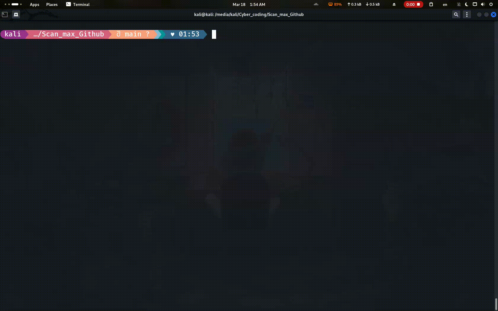

# 🚀 ScanMax Pro

<p align="center">
  
  
  
  
</p>

<p align="center">
  ⚡ <b>AI-Powered Recon & Vulnerability Scanner</b><br>
  <i>Fast. Modular. Scalable.</i>
</p>

---
⭐ Star this repo if you like it!

## 🎯 Why ScanMax Pro?

Most recon tools are:
- ❌ Slow when scaling
- ❌ Hard to automate
- ❌ Output is messy
- ❌ No smart analysis

### ✅ ScanMax Pro solves that:

- ⚡ Runs tools **concurrently**
- 🧠 Optional **AI-powered analysis**
- 📂 Clean & structured outputs
- 🔧 Fully customizable workflow
- 🚀 Designed for real-world recon

---

## 🎬 Demo

> Add your demo GIF here

```markdown

```
## ⚙️ Installation

### 🔹 Clone the Repository

```bash
git clone https://github.com/yourusername/scanmax-pro.git
cd scanmax-pro
```

---

### 🔹 Make Installer Executable

```bash
chmod +x install.sh
```

---

### 🔹 Run Installer

```bash
./install.sh
```

---

### 🔹 Run the Tool

```bash
scanmax example.com
```

> ⚠️ If the command doesn't work, restart your terminal or run:
```bash
source ~/.bashrc
```
---

## 🧠 Features

### 🔍 Core Engine

- Multi-tool execution:
  - `nmap`
  - `subfinder`
  - `httpx`
- Parallel processing with **resource control**
- Batch scanning for large target lists
- Smart subprocess handling:
  - Timeouts
  - Retries
  - Safe shutdown

---

### 🌐 Fuzzing Support

- `gobuster`
- `ffuf`

✔ Custom wordlists  
✔ JSON & CSV outputs  
✔ Subdomain-based scanning  

---

### 🤖 AI Analysis (Optional)

> ⚠️ Experimental Feature

Supports:
- OpenAI API
- HuggingFace
- Ollama (local models)

💡 What it does:
- Analyzes scan results
- Extracts key findings
- Generates clean **Markdown reports**

---

## ⚙️ Workflow

```text
Target → Recon → Subdomains → Live Hosts → Fuzzing → Results → (AI Report)
```

---

## 🛠 Installation

### Requirements

- Python 3.10+
- Tools:
  - `nmap`
  - `subfinder`
  - `httpx`
  - `gobuster` (optional)
  - `ffuf` (optional)

### Setup

```bash
git clone https://github.com/yourusername/scanmax-pro.git
cd scanmax-pro
pip install -r requirements.txt
```

---

## 💻 Usage

### 🔹 Basic Scan

```bash
python scanmax_pro.py example.com --tools nmap subfinder httpx -o results
```

---

### 🔹 With Fuzzing

```bash
python scanmax_pro.py example.com --use-gobuster --wordlist /path/to/wordlist.txt
```

---

### 🔹 With AI

```bash
python scanmax_pro.py example.com --hf-model google/flan-t5-small
```

---

### 🔹 Advanced Example

```bash
python scanmax_pro.py targets.txt \
  --tools nmap subfinder httpx \
  --use-ffuf \
  --wordlist /usr/share/wordlists/rockyou.txt \
  --threads 10 \
  -o results
```

---

## 📊 Tool Comparison

| Feature                | ScanMax Pro | Traditional Tools |
|----------------------|------------|-------------------|
| Multi-tool pipeline  | ✅         | ❌                |
| Parallel execution   | ✅         | limted            |
| AI analysis          | ✅         | ❌                |
| Structured output    | ✅         | ❌                |
| Batch scanning       | ✅         | ❌                |

---

## 📂 Output Structure

```
results/
├── nmap_target.txt
├── subdomains.txt
├── httpx.txt
├── fuzzing.json
├── fuzzing.csv

reports/
└── ai_report.md
```

---

## 📸 Screenshots

```markdown


```

---

## ⚠️ Disclaimer

This tool is for **educational and authorized penetration testing only**.

❗ Unauthorized scanning is illegal.

---

## 📜 License

MIT License © Ahmed

---

## ⭐ Support

If you like this project:
- ⭐ Star the repo
- 🍴 Fork it
- 🧠 Contribute ideas

---

## 👨‍💻 Author

**Ahmed444**  
Cybersecurity Enthusiast | Python Developer | Recon Automation

> "Build tools. Break limits. Think deeper."